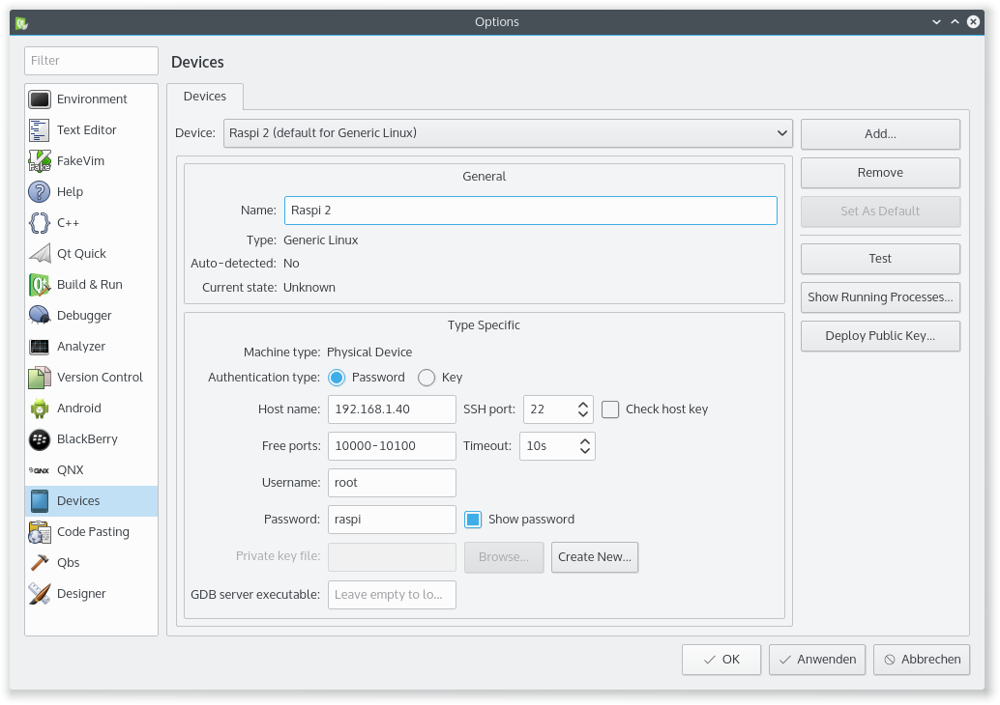
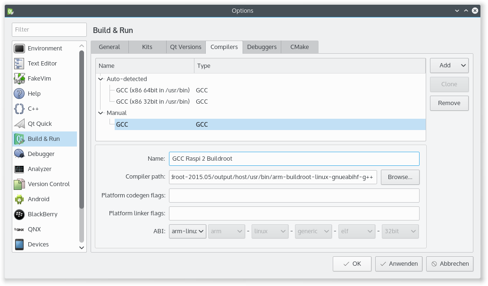
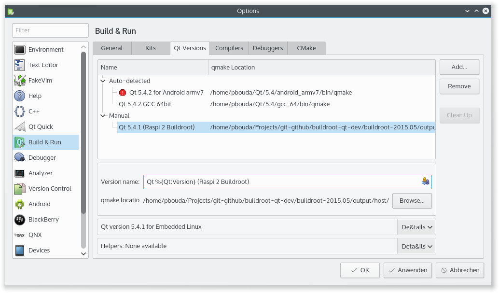
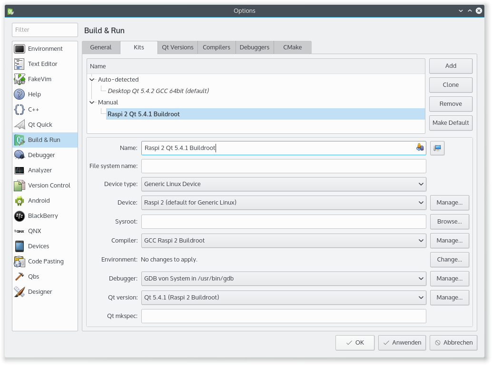
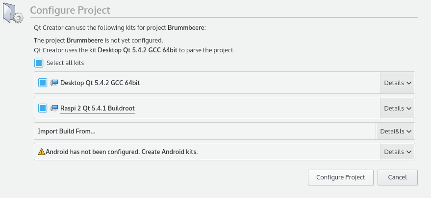
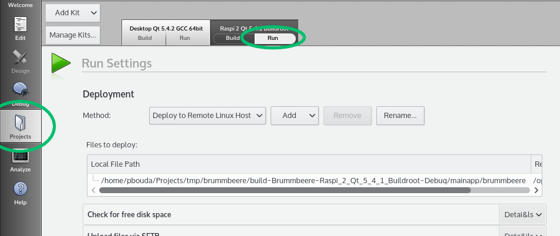
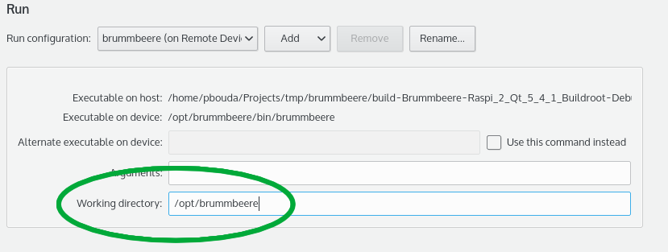

# Setting up Qt Creator for Raspberry development

This guide expects that your compiled the Buildroot toolchain and that you
installed the Buildroot target image on your Raspberry. Your Raspberry should
be turned on and it should be accessible via SSH. For more information please
check the guide to build and install everything in the
[README.md](https://github.com/pbouda/buildroot-qt-dev/blob/master/README.md).

## Install the Qt SDK

First you need to download and install the Qt SDK. You can find all downloads
here:

http://www.qt.io/download/

The Community version works fine. This will install all Qt libraries and the
Qt Creator IDE on your computer.

## Set up the Raspberry Kit in Qt Creator

Now start the Qt Creator that you installed in the previous step. Open the
options dialog in the menu `Tools -> Options...` and then navigate to the
section`Devices` of the dialog. Here we will add the Raspberry as a remote
device, so that we can deploy and run any application later on the Raspberry.
This requires the Raspberry to be turned on and connected to the local network.
As a reminder, to find the IP address of your Raspberry on the network you can
type:

    $ sudo nmap -sP 192.168.1.0/24 | awk '/^Nmap/{ip=$NF}/B8:27:EB/{print ip}'

Then enter the IP address, the user name ("root"), the password ("raspi") and
a device name ("Raspi 2", for example) in the dialog, like shown in the
following screenshot:

Next, change to the section `Build & Run`. Here we will add the GCC compiler of
Buildroot. Click on the tab `Compilers` and then on `Add -> GCC`. Next to the
field `Compiler path` click on `Browse...` and browse to the Buildroot
directory. The cross-compiler `arm-buildroot-linux-gnueabihf-g++` is stored in
`output/host/usr/bin`, the full path might look something like:

    /path/to/buildroot-qt-dev/buildroot-2015.05/output/host/usr/bin/arm-buildroot-linux-gnueabihf-g++

Select the compiler and set a name to find it later (like "GCC Raspi 2 Buildroot"):

Parallel to the compiler we need to set the path to `qmake` in Buildroot.
Change to the tab `Qt versions` and click on `Add...`. Browse again to the
`output/host/usr/bin` of Buildroot and select the `qmake` there. Don't forget
to set a name for your Qt version:

The last step is to create a kit from the device, compiler and the Qt version.
You need to click on `Apply` now in the dialog so that all settings are stored.
Change to the tab `Kits` and click `Add`. Now enter a name for the kit and
choose the device, compiler and Qt version that you just created from the
drop-down lists:

To store your settings click `OK` in the dialog. You are now ready to run your
first game on the Raspberry!

## Run a Qt project on the Raspberry

As example project you can try to compile and run Die Brummbeere, my ownCloud
music player. To clone the project from GitHub type:

	$ git clone https://github.com/pbouda/brummbeere.git

Open the project file of Die Brummbeere in Qt Creator by choosing
`File -> Open File or Project...` from the menu. Browse to the Brummbeere folder
and open `src/Brummbeere.pro`. Qt Creator will open a page with the title
`Configure Project`. Make sure you select the Raspberry kit that you just
created, as shown in the screenshot:

Then click on `Configure Project` to close the dialog and save your settings.
Qt Creator will now parse the project files and generate Makefiles to compile
the game later. Before we run the project, we still have to set the working
directory on the Raspberry in the project settings. Click on `Projects` in the
left pane of Qt Creator and choose the `Run` tab of the Raspberry kit:

Under the heading `Run` you will find the setting for the `Working directory`.
Enter `/opt/Brummbeere` into the input field:

You are now ready to start the application on the Raspberry. If you
followed the instructions above, the connection settings are already stored in
Qt Creator as part of the Qt kit. Click on the `Run` button of Qt Creator in
the lower left corner (the big green Play button). Qt Creator will now compile,
deploy and run Die Brummbeere on the Raspberry!

Feel free to play around with the Die Brummbeere code to make yourself familiar
with Qt Creator and the development process. Whenever you change some code now
you can simply press `Run`, and the modified version will be started on the
Raspberry. Happy coding!

## Need help?

Contact me here: http://www.peterbouda.eu/#contact

I am available to hire, contact me if you need a programmer for your Embedded
Qt project!